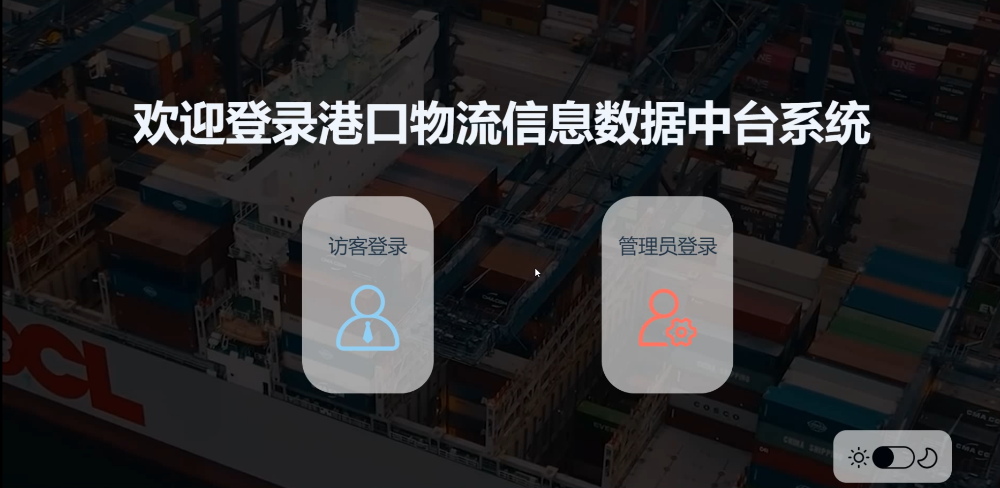
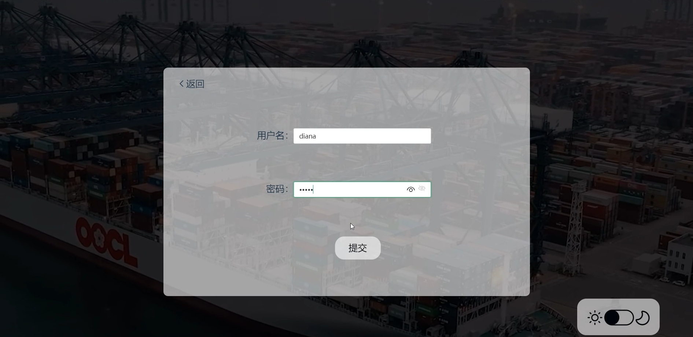
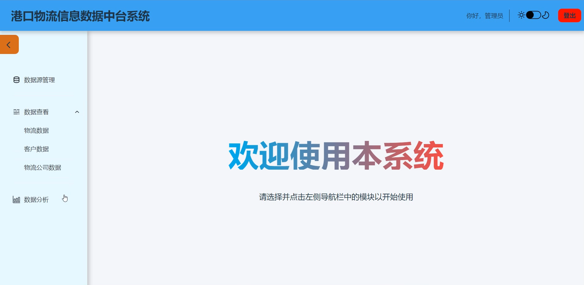
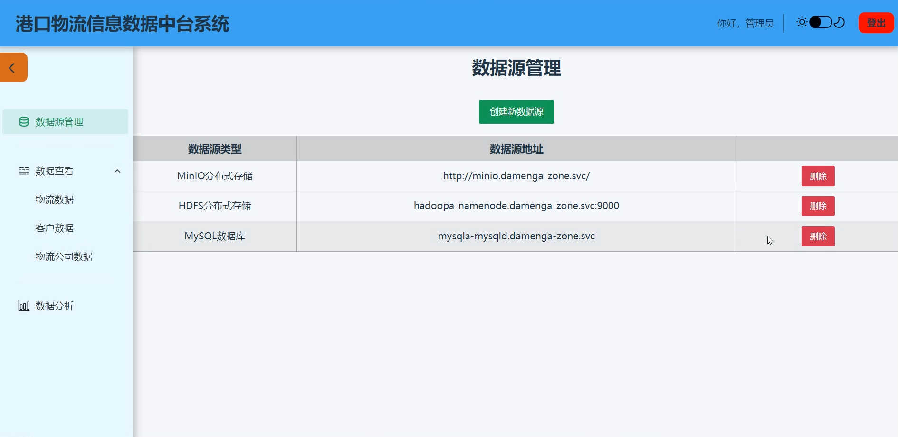
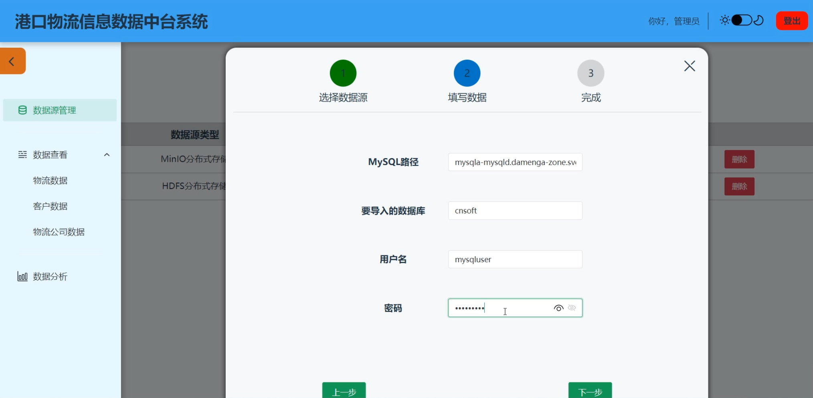
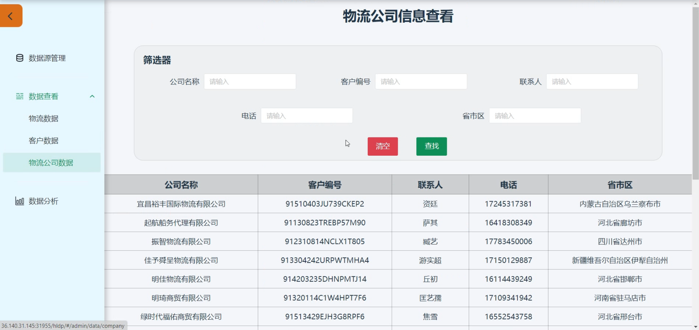
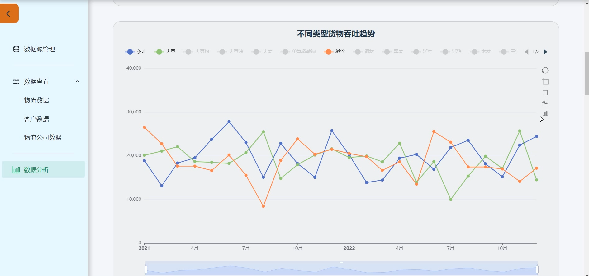

# 基于达梦云原生大数据平台的物流信息数据中台系统

## 前言

现在看来当时还真是头铁，后端居然没有用任何框架（其实是没来得及学），硬是写了出来。前端我一开始也想用Vue手搓各种组件，奈何代码量实在太大，如果真要手搓组件，那后端就没时间写了，于是乎临时学了一个组件库NaiveUI，最后的效果也还凑合。学了一些框架再回来看这些代码，发现很多当时写到手累心累的代码，都可以用框架中更为简洁清晰的方式来表达，省下来的功夫就能让我去开发更丰富的功能。只有写过这些复杂冗余的代码，才能真正切身体会到框架的便利性🥹

## 功能展示

说实话没啥功能，挺简陋的

- 登录界面

  

  点击访客登录就直接进入主页面了，点击管理员登录则要输入用户名密码才能进入主页面

  

- 主页面

  

  以上就是管理员的主页面。访客主页面与管理员主页面的唯一不同就是前者没有数据源管理这个功能，就不放图了

- 数据源管理

  

  添加数据源功能展示（只截取其中一个步骤）

  

- 数据查看（只展示物流公司数据）
  

- 数据分析（只展示一个图表）
  

## 结语

大概的功能就这些了。简陋吗？简陋得一批好吧。但不管怎么说，好歹是第一次尝试，还是值得小小鼓励一下的。
